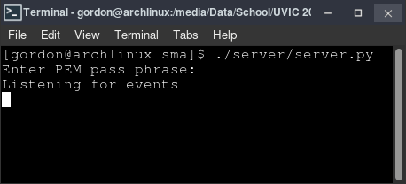
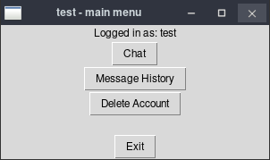
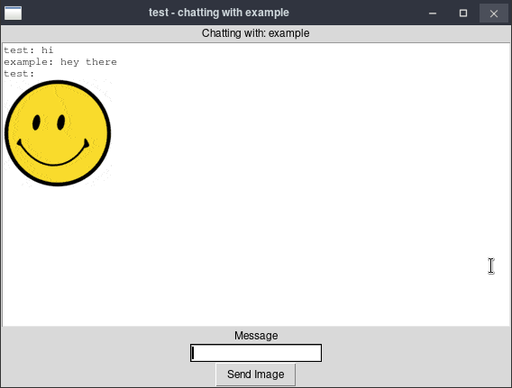

# Secure Messaging Application

This is the repository for Secure Messaging Application for **Group 16: Gordon Chiang, Lagan Chohan, Tyler Fowler, and Alex Li**.

Secure Messaging Application is a Python program that allows users to securely and synchronously message one another.

## Installation

Secure Messaging Application requires **Python 3.9 or higher**.

After cloning the repo, run `pip install -r requirements.txt` from the root directory to install all dependencies.

## Usage

### Server

1. Setup the server from the **root directory** to generate a certificate: `python3 ./server/server.py`.
    * The pathing ensures the client can locate and load the certificate to establish a TLS connection with the server.
2. The server will prompt for the private key PEM's pass phrase, which is currently hardcoded as `passphrase`.
3. The server will output `Listening for events` to the terminal when it is setup and ready to accept clients and listen for events.

### Client

1. With the server running, create a client instance: `python3 ./client/client.py`.
2. The client's GUI will load which will prompt the user for account management events:
    1. Login: login to an existing account with the server using a username and password.
    2. Register: register a new account with the server using a username and password.
    3. Exit: close the client.

3. Once the user is authenticated into a user account, they may choose various options:
    1. Chat: select a user with whom to chat synchronously.
    2. Message History: view the saved message history with a user (password-protected).
    3. Delete Account: delete the currently logged in account from the server (password-protected).
    4. Exit: close the client.

4. You may create multiple client instances for testing purposes.

